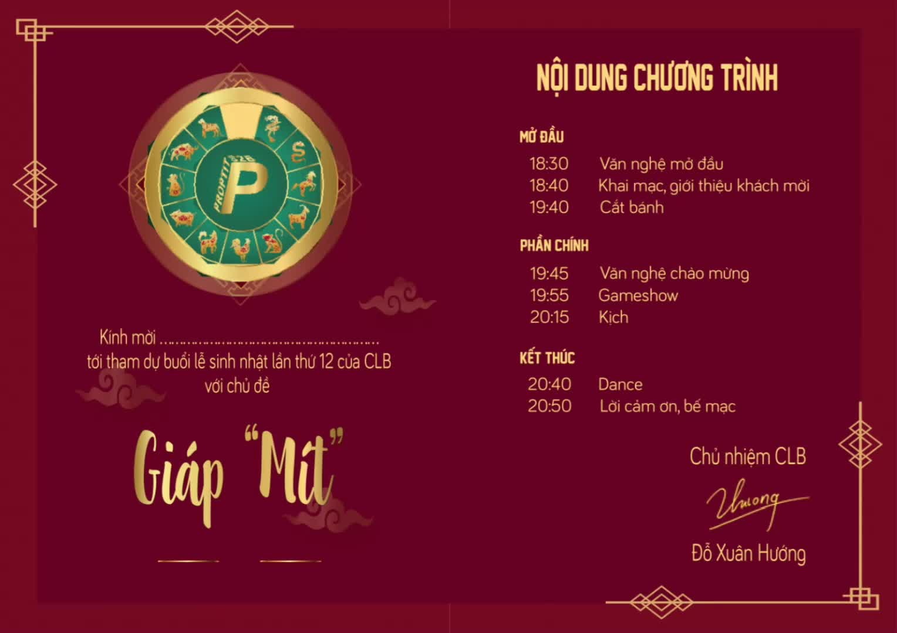

# ProAR12thBirthday

**Introduction**

ProAR12thBirthday is an augmented reality project that creates a birthday card that can display a video when the camera points at it. The project uses the ImageAR SDK and the Mindar library to track the camera's position and orientation and to display the video.

**Demo**

Web: https://quochung-cyou.github.io/ImageAR-ProPTIT12th/

Demo gif: 

**Requirements**

* A smartphone or tablet with a camera
* The ImageAR SDK and the Mindar library
* A video to be displayed

**Installation**

1. Clone the repository to your computer.
2. Install the ImageAR SDK and the Mindar library.
3. Add the video to the `videos` directory.

**Usage**

1. Open the `ProAR12thBirthday.app` file on your device.
2. Point the camera at the birthday card.
3. The video will be displayed.

**Contributing**

This project is open source and contributions are welcome. Please read the contribution guidelines: [CONTRIBUTING.md](CONTRIBUTING.md) for more information.

**License**

This project is licensed under the MIT License.

**Screenshots**

**Additional Information**

* This project was created by quochung-cyou for the 12th birthday of ProPTIT.
* The project was created using the following technologies:
    * ImageAR SDK
    * Mindar library
* The project is still under development.

**Contact**

If you have any questions or feedback, please contact nguyenquochung.workvn@gmail.com